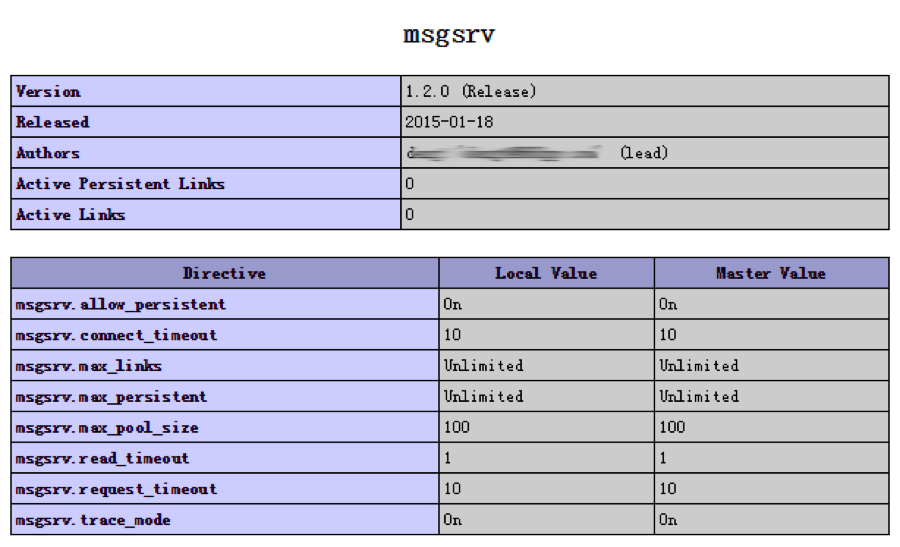

## MsgSrv PHP Extension

***v1.2.0 Release***

msgsrv扩展是基于PHP的扩展标准使用Zend API开发，为PHP提供快速方便的msgsrv服务调用方案，并支持msgsrv长连接。
1. 建立连接
2. 发送或请求操作
3. 关闭连接

### 1 建立连接
#### 1.1 直接连接

    resource msgsrv_connect(string $host, int $port, string $app, string $user, string $pass);

**说明:**
连接到msgsrv并返回可用连接，连接失败返回`FALSE`。
注：为兼容v1.0保留方法msgsrv_open,和该方法参数一致。
**参数：**

| 参数 | 说明 |
| --- | --- |
|host  | msgsrv服务器地址 |
|app  | 登录app名称 |
|user  | 登录用户名 |
|pass  | 登录密码 |

**返回值：**

如果成功则返回一个 msgsrv 连接，或者在失败时返回`FALSE`。

**范例：**

    <?php
        $link = msgsrv_connect('10.2.10.202', 1001, 'PHP', 'PHP', 'PHP');
        if (!$link) {
            die('Could not connect msgsrv…');
        }
        echo 'Connected successfully!';
        msgsrv_close($link);
    ?>

#### 1.2 建立连接(兼容)

    resource msgsrv_open(string $host, int $port, string $app, string $user, string $pass[, int persistent]);

**说明：**
连接到msgsrv并返回可用连接，连接失败返回`FALSE`。
注：为兼容v1.0保留方法，persistent默认值0。

| 参数 | 说明 | 默认值 |
| --- | --- | --- |
|host  | msgsrv服务器地址 | - |
|app  | 登录app名称 | - |
|user  | 登录用户名 | - |
|pass  | 登录密码 | - |
|persistent[可选]  | 长连接标识，1长连接，0段连接。 | 0 |

**返回值：**
如果成功则返回一个 msgsrv 连接，或者在失败时返回`FALSE`。

**范例：**

    <?php
        $link = msgsrv_open('10.2.10.202', 1001, 'PHP', 'PHP', 'PHP');
        if (!$link) {
            die('Could not connect msgsrv…');
        }
        echo 'Connected successfully!';
        msgsrv_close($link);
    ?>

#### 1.3 建立长连接

    resource msgsrv_pconnect(string $host, int $port, string $app, string $user, string $pass);

**说明:**
连接到msgsrv并返回可用连接，连接失败返回FALSE。如果当前PHP环境不支持ZTS将自动转为普通连接。每次连接创建随机使用使用连接`1 ~ msgsrv.max_pool_size`的连接，
1.	若连接不存在，则建立连接，并返回长连接；
2.	若连接存在，且不在使用中，则测试连接可用，可用则返回该连接作为长连接；测试不可用时则释放连接并重新尝试建立长连接。
3.	若连接存在，且使用中，则直接转使用普通连接。
**参数：**

| 参数 | 说明 |
| --- | --- |
|host  | msgsrv服务器地址 |
|app  | 登录app名称 |
|user  | 登录用户名 |
|pass  | 登录密码 |

**返回值：**

如果成功则返回一个 msgsrv 连接，或者在失败时返回`FALSE`。

**范例：**

    <?php
        $link = msgsrv_pconnect('10.2.10.202', 1001, 'PHP', 'PHP', 'PHP');
        if (!$link) {
            die('Could not connect msgsrv…');
        }
        echo 'Connected successfully!';
        msgsrv_close($link);
    ?>

### 2 消息请求

#### 2.1 发送请求

    array msgsrv_request ( string $target, string $cmd, string $body, resource $link [, long $timeout ] )

**说明：**
通过连接发送指定消息，并在timeout时间内阻塞等待结果返回，若成功返回返回结果数组，失败返回FALSE。
*返回Array原型：*

    array(3) {
          ["from"]=> string(15) "root.e.f6.M6010"
          ["cmd"]=> string(4) "Echo"
          ["body"]=> string(138) "body"   /* 如果返回数据没有body字段，则数组也无该成员！ */
    }
    

**参数：**

| 参数 | 说明 |
| --- | --- |
|target  | 目标app名。 |
|cmd  | 发送消息命令。 |
|body  | 发送消息内容字段。 |
|link  | 通过该msgsrv连接发送消息。 |
|timeout[可选]  | 等待请求结果返回超时时间，单位s，默认值为php.ini中配置的`msgsrv.request_timeout`参数。 |

**返回值：**
如果成功则返回应答数组，或者在失败时返回`FALSE`。

**范例：**

    <?php
        $link = msgsrv_pconnect('localhost', 1001, 'PHP', 'PHP', 'PHP');
        if (!$link) {
            die('Could not connect…');
        }
        echo 'Connected successfully!';
        if (($response = msgsrv_request("root", "Echo", "content", $link)) == FALSE) {
            echo 'request failed! ' . msgsrv_last_error($link);
        }
        msgsrv_close($link);
    ?>
#### 2.2 仅发送消息

    bool msgsrv_send ( string $target, string $cmd, string $body, resource $link)

**说明：**
通过连接发送指定消息，成功发送后返回，发送成功返回`TRUE`，失败返回`FALSE`。

**参数：**

| 参数 | 说明 |
| --- | --- |
|target  | 目标app名。 |
|cmd  | 发送消息命令。 |
|body  | 发送消息内容字段。 |
|link  | 通过该msgsrv连接发送消息。 |

**返回值：**
如果成功则返回`TREU`，或者在失败时返回`FALSE`。

**范例：**
    
     <?php
     $link = msgsrv_connect('localhost', 1001, 'PHP', 'PHP', 'PHP');
     if (!$link) {
        die('Could not connect…');
     }
     echo 'Connected successfully!';
     if (msgsrv_send("root", "cmd", "content", $link) == FALSE) {
        echo 'message send failed! ' . msgsrv_last_error($link);
         exit();
     }
     echo 'message sent!';
     msgsrv_close($link);
     ?>
     
#### 2.3 主动接收消息
    bool msgsrv_receive (function callback[, int $timeout[, int $limit[, resource $link]]])

**说明：**
主动接收消息，接收所有成功返回TRUE，出现异常返回FALSE。
*返回callback原型：*

    function ($status, $from, $cmd, $body, $link) {
        if ($status == 1) {
            echo 'Response:' . $from . ' ' . $cmd . ' ' . $body;
        } else {
            echo 'Request failed!' . $status;
        }
    }
***注：若发生找不到目标APP，也会触发callback回调。
***

**参数：**

| 参数 | 说明 |
| --- | --- |
|callback  | 处理结果回调函数。 |
|timeout[可选]  | 等待结果超时时间，单位s，默认值为php.ini中配置的`msgsrv.request_timeout`参数。 |
|limit[可选]  | 接收消息条数限制，默认1条。 |
|link[可选]  | 指定只接收该连接的消息。默认接收所有连接的消息。 |

### 3 其他方法
#### 3.1 查看连接地址

    string msgsrv_full_app(resource $link)

**说明：**
返回获取指定连接的full_app。

#### 3.2 获取错误信息

    int msgsrv_last_error(resource $link)

**说明：**
返回指定连接最近发生错误的错误码。

#### 3.3 关闭连接

    bool msgsrv_close(resource $link)

**说明：**
****关闭指定msgsrv连接，
*注：对于长连接不会断开，仅释放连接资源，并返回连接到连接池。*

### 安装配置

#### 1. 参数配置

| 参数 | 说明 |
| --- | --- |
|msgsrv.trance_mode |开启跟踪模式[1开启，0关闭（默认）]。开启调试模式后，扩展将通过syslog记录所有通信报文。|
|msgsrv.allow_persistent | 允许长连接开关，[1允许，0关闭(默认)]。开启后，允许msgsrv连接公用。关闭后，所有msgsrv_pconnect打开的连接都默认使用短连接。|
|msgsrv.max_persistent | 扩展允许最大长连接数量，包括长连接与短连接至和。当超过后连接将不允许建立失败。当为-1时不限制；默认-1。|
|msgsrv.max_links | 扩展允许最大连接数量[>0, -1(默认)]，包括长连接与短连接至和。当超过后连接将不允许建立失败。当为-1时不限制；默认-1。|
|msgsrv.max_pool_size | 配置每个app的长连接池数量大小，当超过连接数量大小后，将转使用普通短连接。|
|msgsrv.connect_timeout | 连接超时时间，在扩展连接到msgsrv的超时时间；单位s，默认10s。|
|msgsrv.request_timeout | 请求时默认超时时间，请求超时也可以在使用msgsrv_request函数时通过timeout指定，若未指定将会使用这里配置的时间；单位s，默认10s。|
|msgsrv. read_timeout | 类似select函数中的每次轮询超时时间；单位s，默认2s。|

#### 2 安装并启用扩展
在php.ini中添加如下配置：

    ; configuration for php msgsrv module
    extension=msgsrv.so

在php.ini中添加msgsrv参数如下：

    [msgsrv]
    msgsrv.trace_mode = On
    msgsrv.allow_persistent = On
    msgsrv.max_persistent = 200
    msgsrv.max_links = -1
    msgsrv.connect_timeout = 16
    msgsrv.request_timeout = 16
    msgsrv.read_timeout = 1
    msgsrv.max_pool_size = 1
    msgsrv.link_idle_timeout = -1

所有都配置好后，保存配置然后重启php-fpm即可。
#### 3 验证安装成功
以上安装完成后，通过查看phpinfo找到msgsrv相关配置正常显示即安装成功，如下图：

### 附录

#### I 错误码定义
|结果码|描述|
|---|---|
|0|没有错误|
|3112|数据读取超时|
|3111|数据读取错误|
|3113|数据写入失败|
|3102|连接已断开|
|3501|其他未知错误，可能是bug。|
|3002|底层协议错误，可能是bug。|
|3404|目标APP未连接|

#### II 回调函数状态

|结果码|描述|
|---|---|
|1|消息接受成功|
|0|读取消息超时|
|-1|连接已关闭|
|-2|数据读取出现异常|
|-3|底层协议错误|
|-4|目标APP未连接|
|-9|其他未知错误，可能是bug。|

